# Tom and Jerry Workflow using Git and GitHub.

## 1. Git Installation
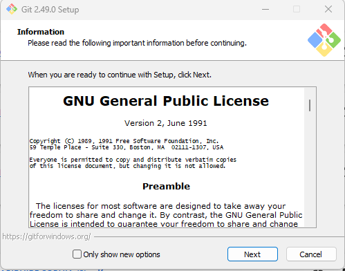

## 2. Git Verification
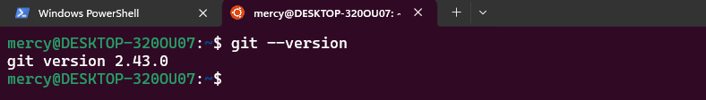

## 3. Sign into GitHub and Click on New Repository 
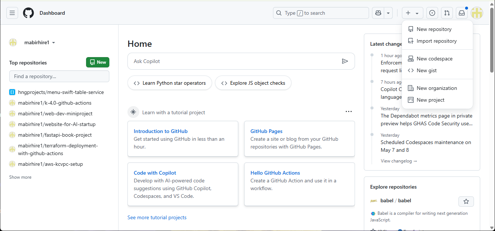

## 4. Create a GitHub Repository 
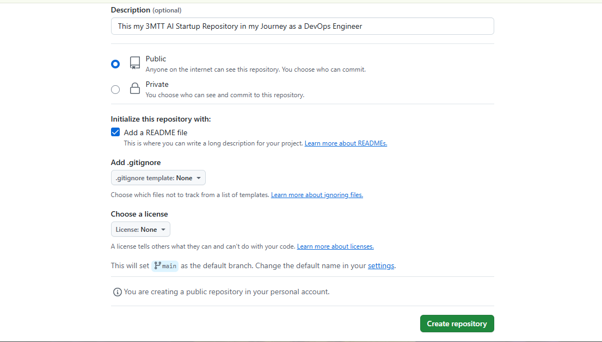

## 5. Copy HTTPS URL 
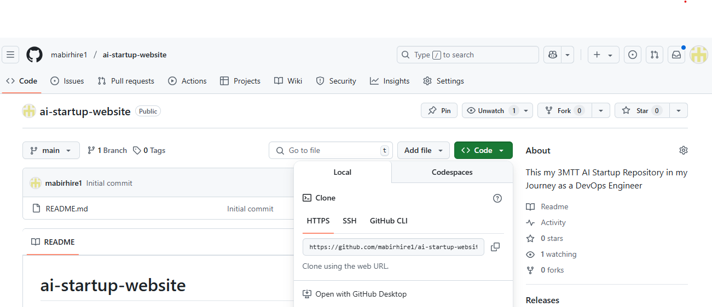

## 6. Create folder and clone Repository 
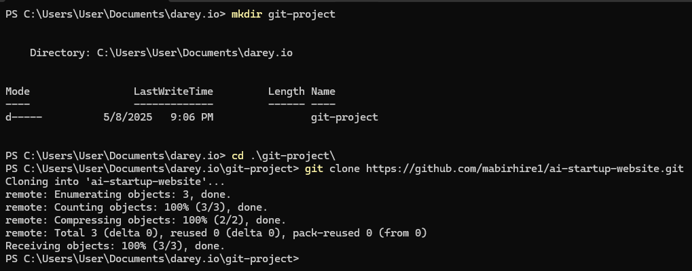

## 7. Create New Branch for Tom
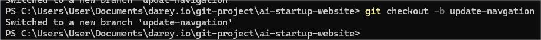

## 8. Check Branch
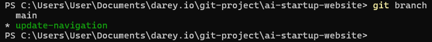

## 9. Unstaged Changes 
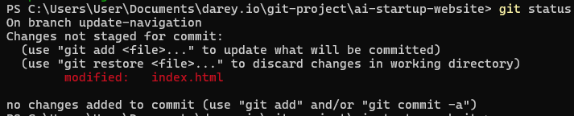

## 10. Staged Changes to Commit
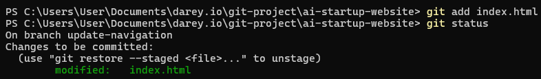

## 11. Commit and Push to Repository 
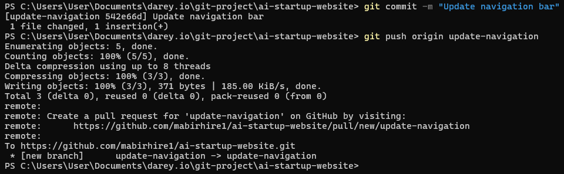

## 12. Contact Info Branch Creation and Push to te Repository
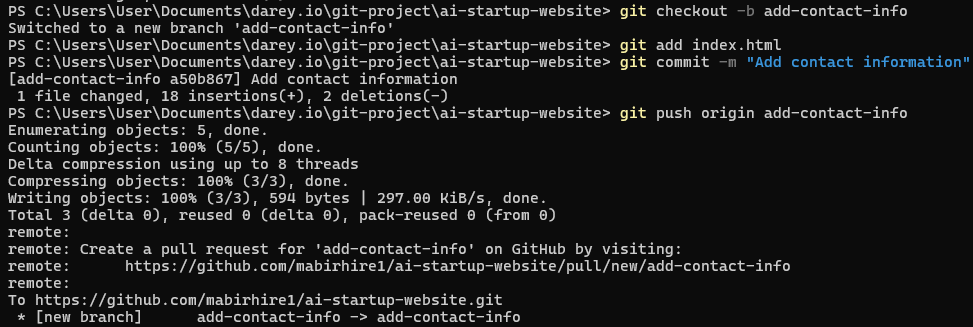

## 13. Updated GitHub Repository with Pull Request
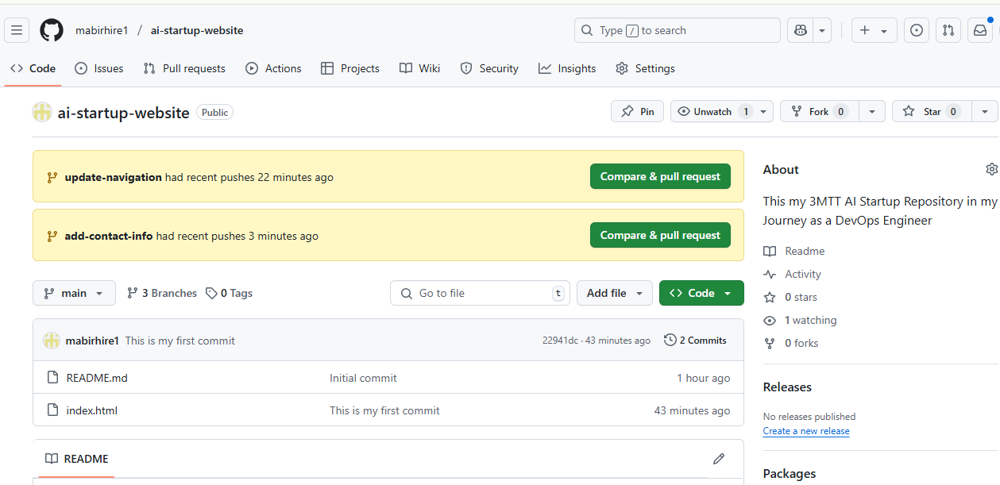

## 14. On the Repository switch to update Information Branch
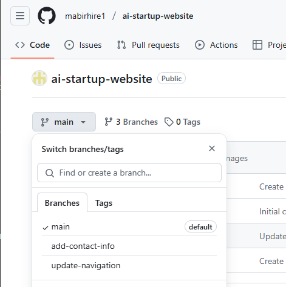

## 15. Create New Pull Request
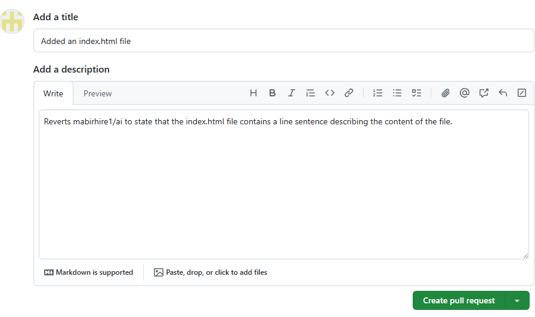

## 16. Check for Conflicts and Resolve if Any
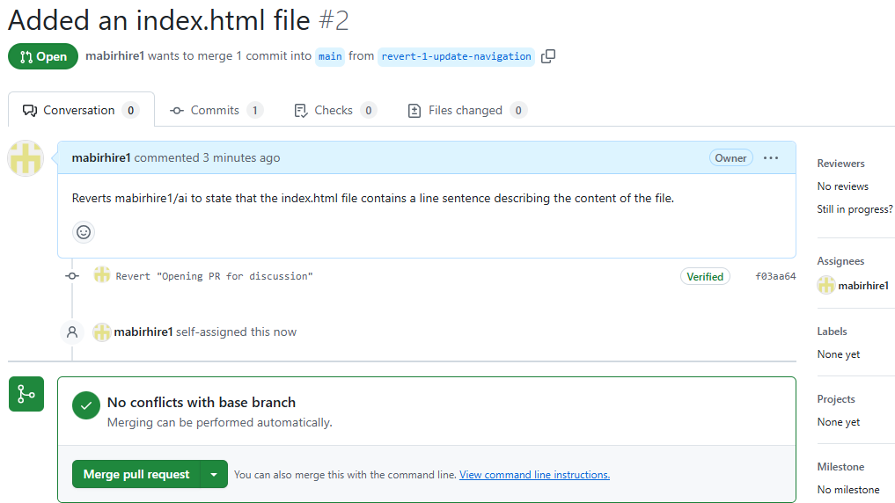

## 17. Review and merge
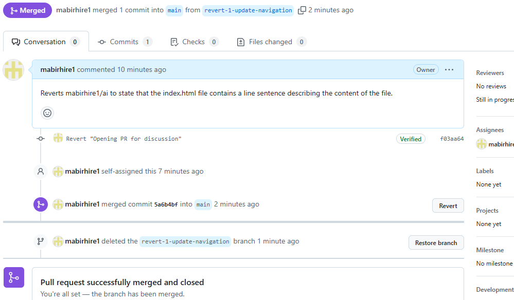

## 18. Switch to Contact Branch and Reconsile
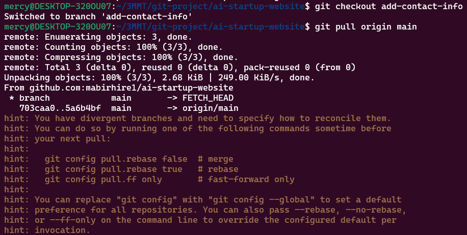

## 19. Create PR for Contact Branch
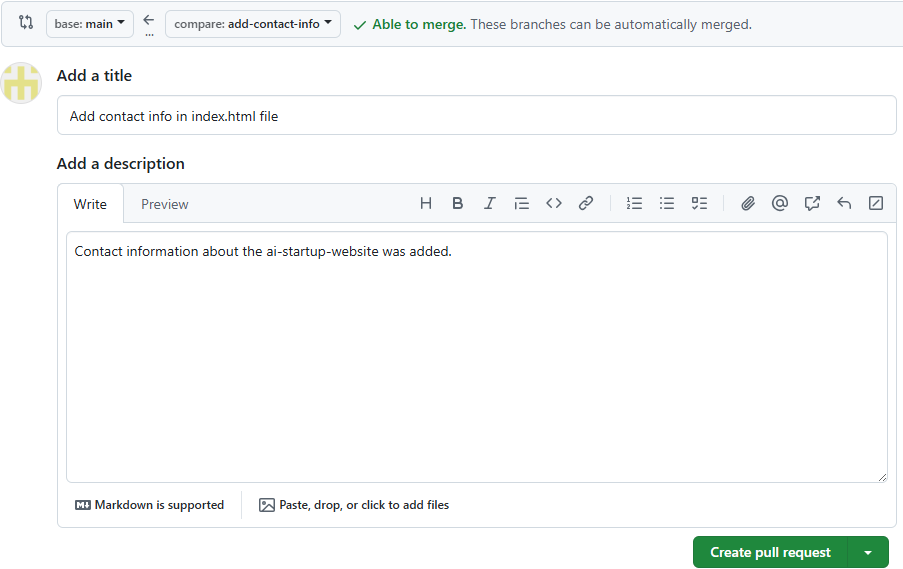

## 20. Review Changes
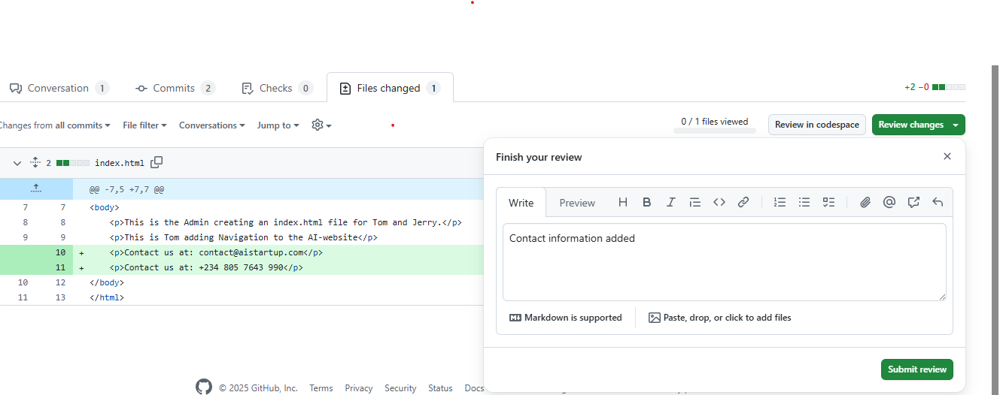

## 21. Merge PR
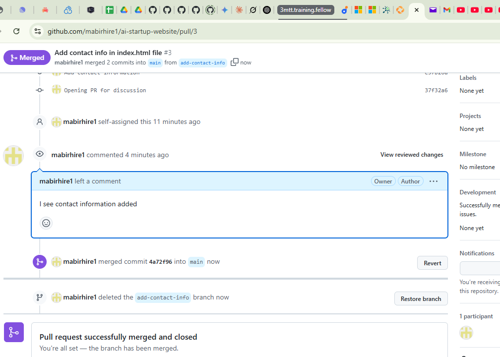

## 22. Switch to Main Branch and Pull current changes
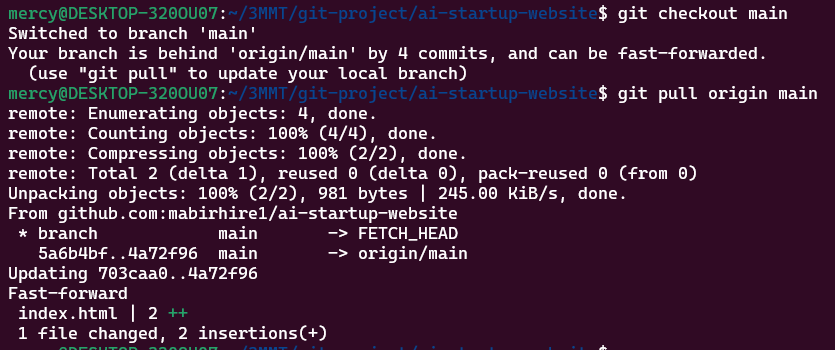

## 22. Project Updated withh All Contributions
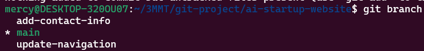

---

## ⚠️ Challenges Faced & Resolutions

| Challenge                         | Description                                                       | Resolution                                                        |
|----------------------------------|-------------------------------------------------------------------|-------------------------------------------------------------------|
| Committing to wrong branch       | Accidentally committed to `add-contact-info` instead of `main`    | Used `git checkout main`, ensured changes were in sync, then pushed correctly |

| Divergent branches error         | Got error while pulling: “need to specify how to reconcile”        | Used `git pull --rebase` to rebase instead of merge              |

| No upstream branch tracking      | Push error when branch wasn’t tracking remote                      | Used `git push --set-upstream origin add-contact-info`           |                    |

| Forgetting to switch branches    | Made edits in `main` by mistake                                    | Used `git stash`, switched to correct branch, then applied stash |

