# Tom and Jerry Workflow using Git and GitHub.

## 1. Git Installation
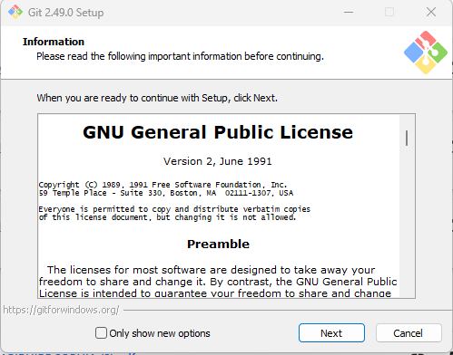

## 2. Git Verification
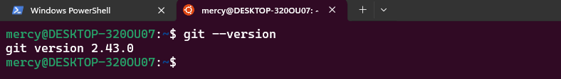

## 3. Sign into GitHub and Click on New Repository 
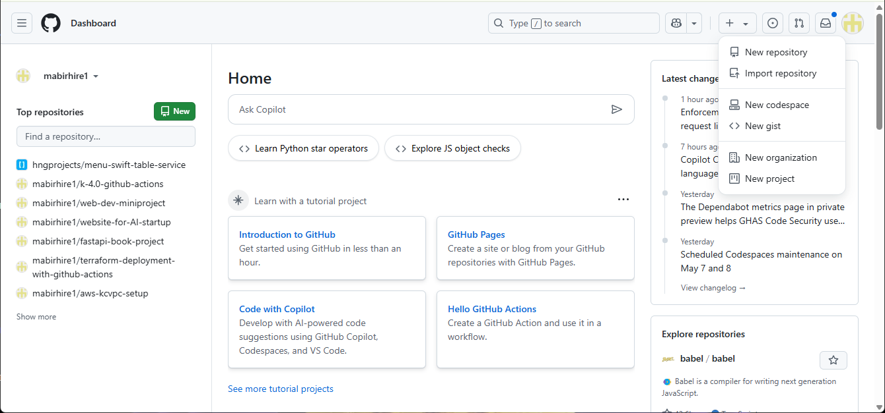

## 4. Create a GitHub Repository 
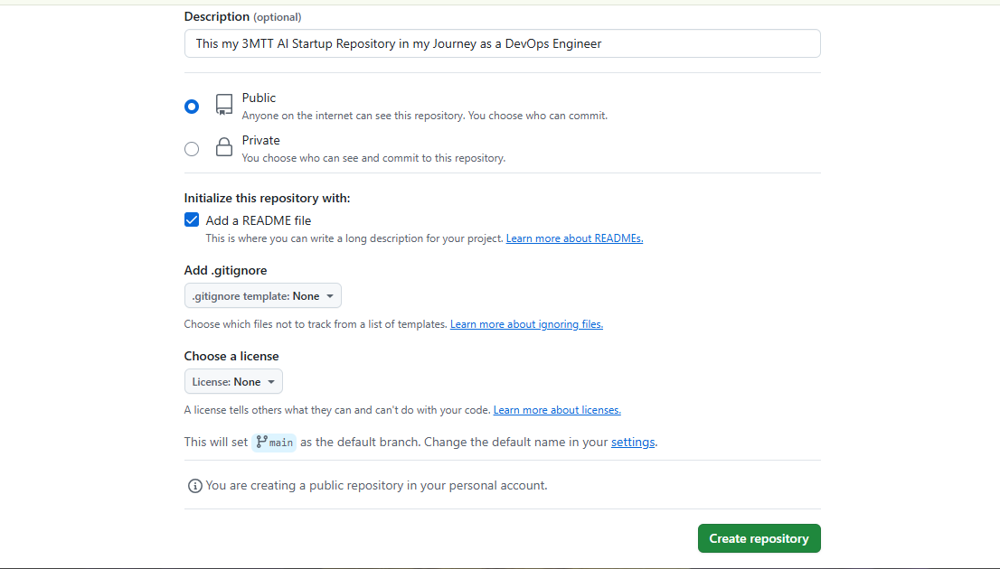

## 5. Copy HTTPS URL 
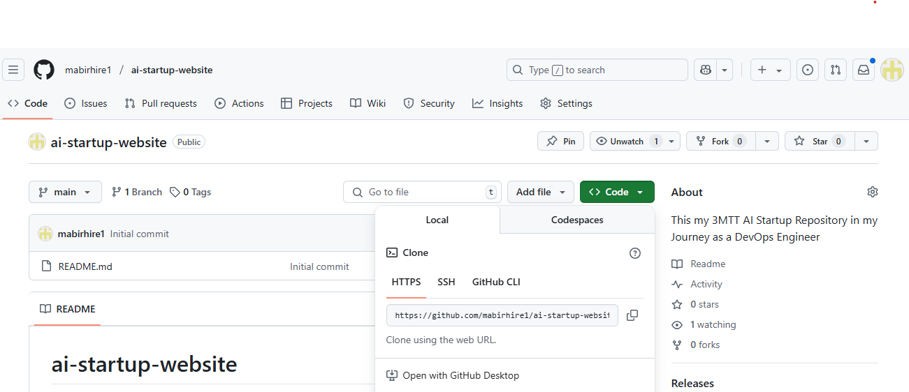

## 6. Create folder and clone Repository 
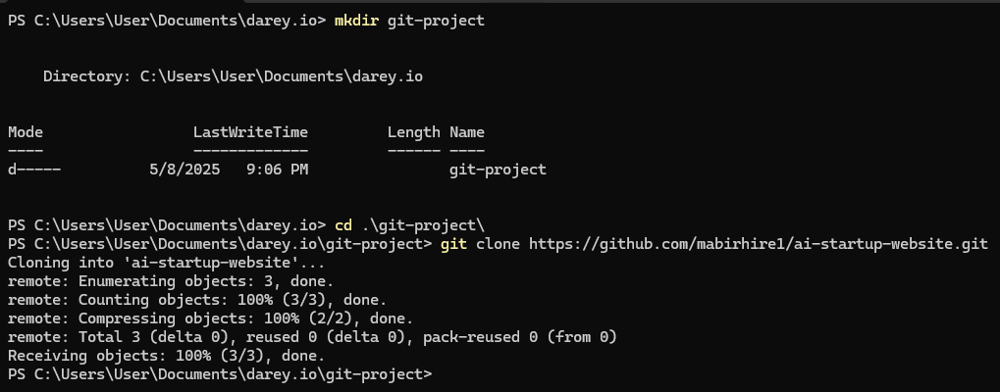

## 7. Create Index.html File, Stage and Push
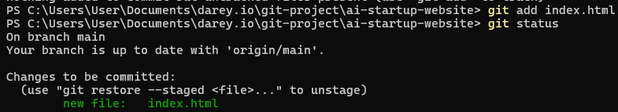

## 8. Navigation Branch Creation
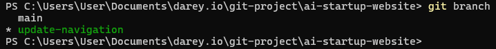

## 9. Update Index.html File 
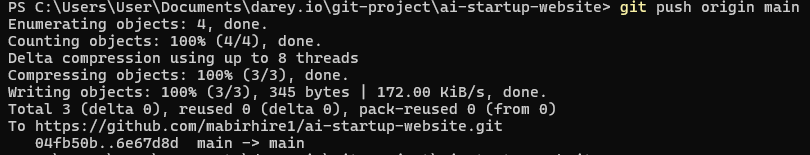

## 10. Commit and Push to Repository 
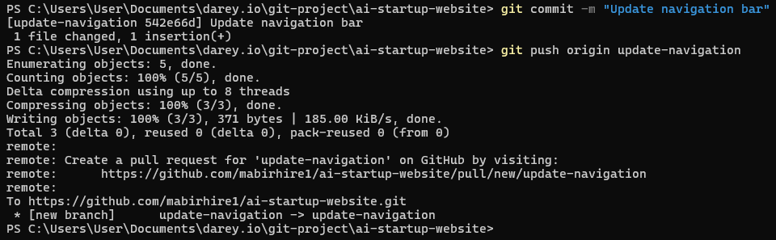

## 11. Contact Info Branch Creation and Push to te Repository
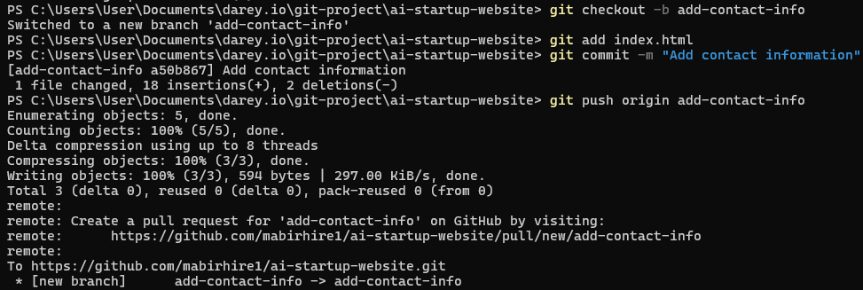

## 12.  Updated GitHub Repository with Pull Request
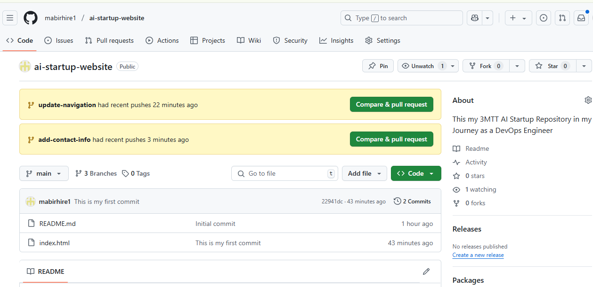